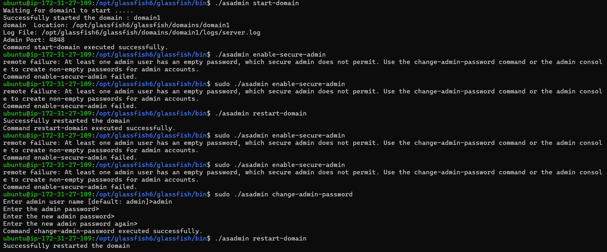
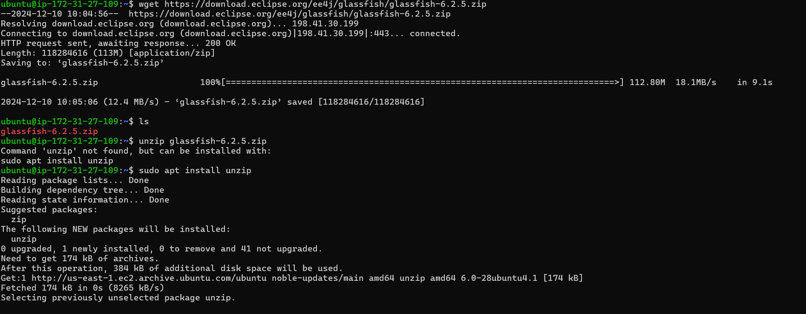
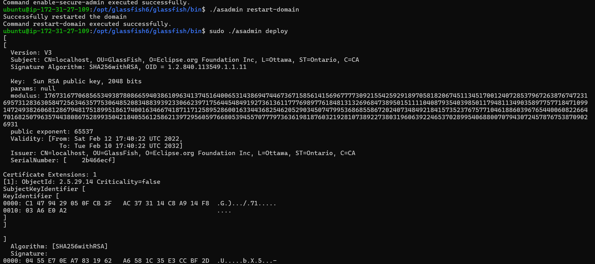
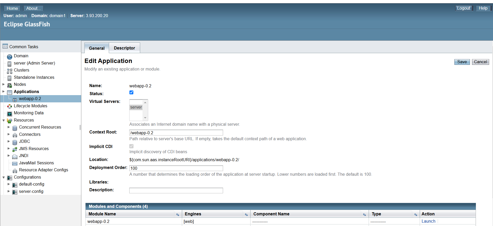

# Document: Deploying an Application using GlassFish with Java Artifact on EC2

# 1. Introduction

This document outlines the steps to deploy an application using GlassFish with a Java artifact on an Amazon EC2 instance. The process includes instance setup, environment configuration, and application deployment.

# 2. Pre-requisites

AWS Account: Ensure you have an active AWS account.

Java Artifact: Have the Java application artifact (e.g., .war file) ready.

Key Pair: Create an SSH key pair in AWS for secure instance access.

Security Group Configuration: Allow inbound traffic for:

SSH (Port 22)

HTTP (Port 80)

HTTPS (Port 443)

GlassFish Admin Console (Port 4848)

# 3. Steps to Deploy Application

Step 1: Launch EC2 Instance

Log in to the AWS Management Console.

Navigate to EC2 > Instances and click Launch Instances.

Choose Amazon Linux 2 as the AMI.

Select an instance type (e.g., t2.micro for free-tier eligibility).

Configure security groups to allow SSH (22), HTTP (80), HTTPS (443), and GlassFish (4848).

Add a key pair for SSH access.

Launch the instance.

# Step 2: Connect to the EC2 Instance

Use SSH to connect to the instance:

ssh -i <your-key.pem> ec2-user@<public-ip>

# Step 3: Update the System and Install Required Packages

Update the system:

sudo yum update -y

Install Java Development Kit (JDK):

sudo yum install java-11-openjdk -y

Verify Java installation:

java -version

# Step 4: Download and Install GlassFish

Navigate to the GlassFish official website and copy the download link.

Use wget to download GlassFish:

wget https://download.oracle.com/glassfish/6.2.5/release/glassfish-6.2.5.zip

Install unzip and extract GlassFish:

sudo yum install unzip -y
unzip glassfish-6.2.5.zip

Move GlassFish to a desired location:

sudo mv glassfish6 /opt/glassfish6

# Step 5: Configure GlassFish

Navigate to the GlassFish bin directory:

cd /opt/glassfish6/bin

Start the GlassFish server:

./asadmin start-domain

Access the GlassFish Admin Console at http://<public-ip>:4848.

# Step 6: Deploy the Java Artifact

Log in to the GlassFish Admin Console.

Navigate to Applications > Deploy....

Upload the Java artifact (.war file) and follow the deployment instructions.

Confirm that the application is accessible at http://<public-ip>:8080/<app-name>.

sudo systemctl daemon-reload
sudo systemctl enable glassfish

# COMMANDS FROM SCRATH FOR REFERENCE

